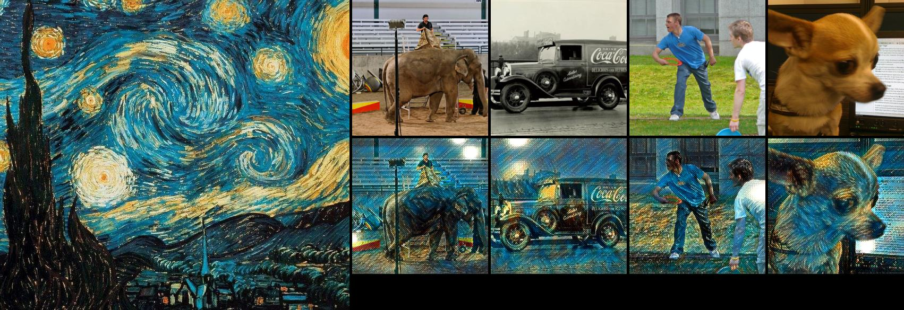
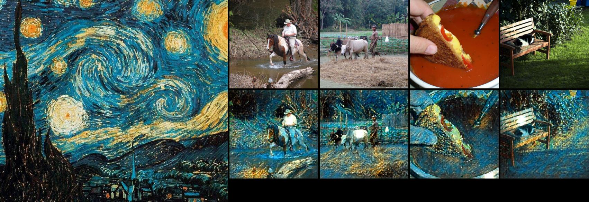

# 2020-39--Style-transfer
 
1.通过Vgg16 TransformNet 神经网络模型实现图像的风格迁移
 
2.使用Colab平台和Coco2017数据集训练模型
 
 
文件说明： 
 
  Train on Colab.ipynb  训练神经网络 
   
  Transfer.py           快速风格迁移函数 
   
  StyleTransferGui.py   快速风格迁移图形化界面 
   
训练过程：
 
  
  
 
迁移结果： 
 
  
